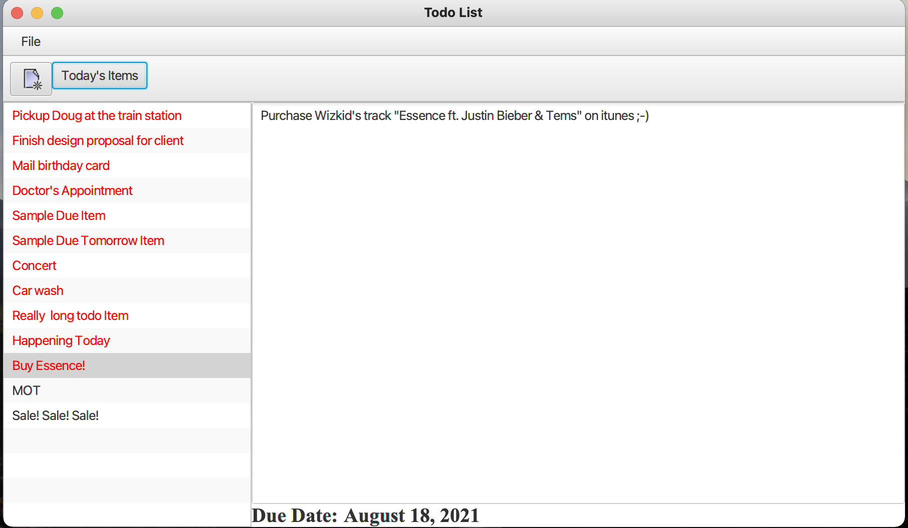
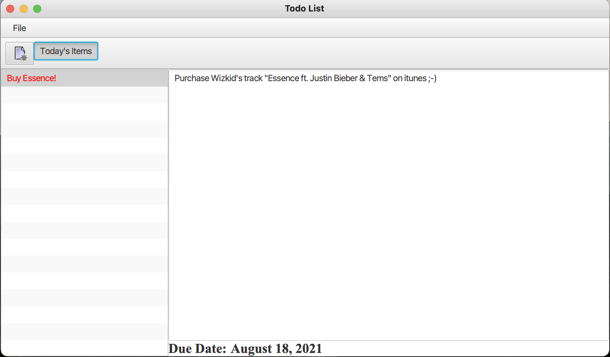
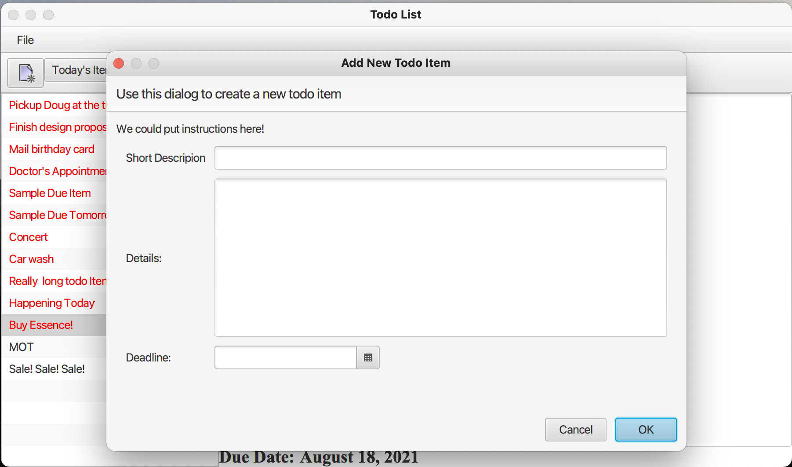
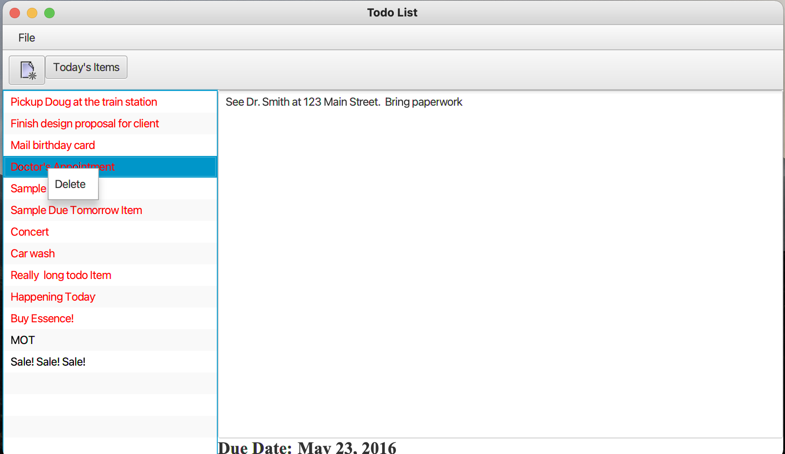

# Todo List Project 
## Project Brief:
Design and Implement a Todo List application, using Java 8 and Java FX for it's User Interface.
## Installing:
1. Clone the repo

```
https://github.com/AAdewunmi/ToDo_List.git
```

2. Open Project Folder


3. Explore

Enjoy :)
## UI Screenshots
1. Opening Screen



2. Today's Item Screen



3. Add New Item Screen



4. Delete Item Screen


